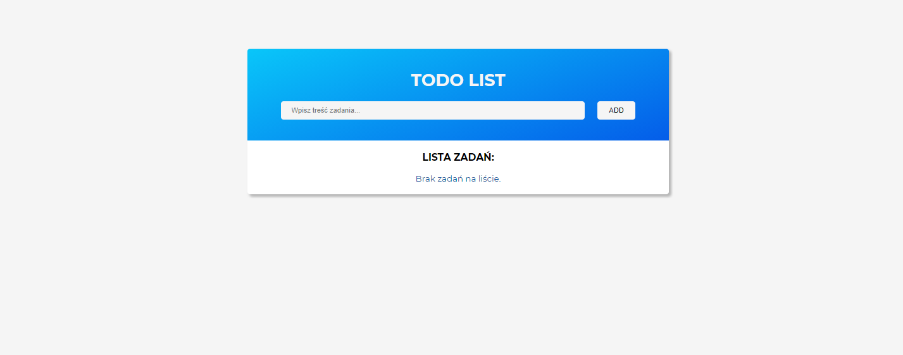
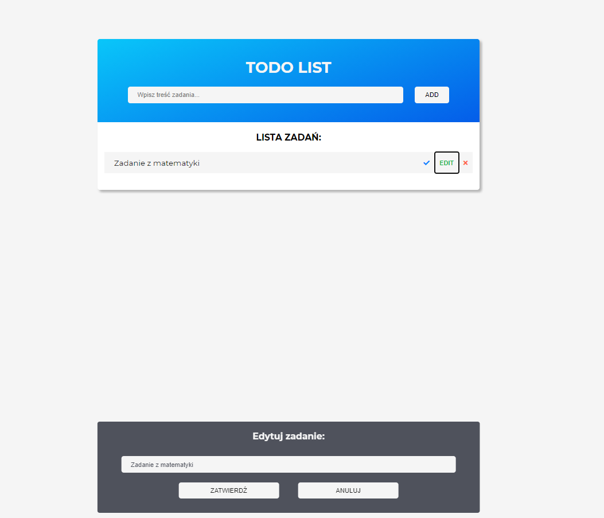
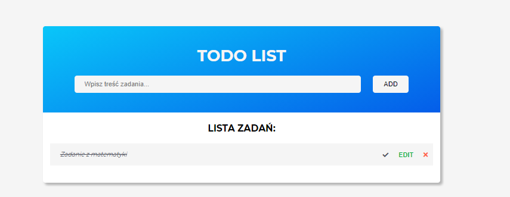
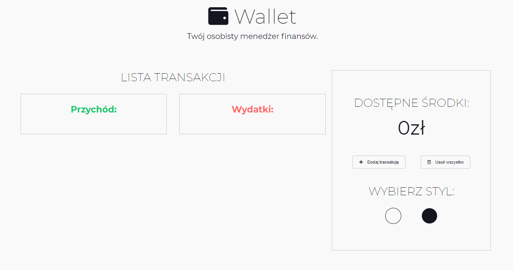
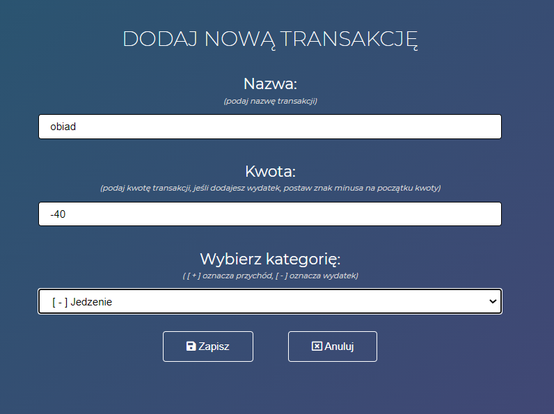
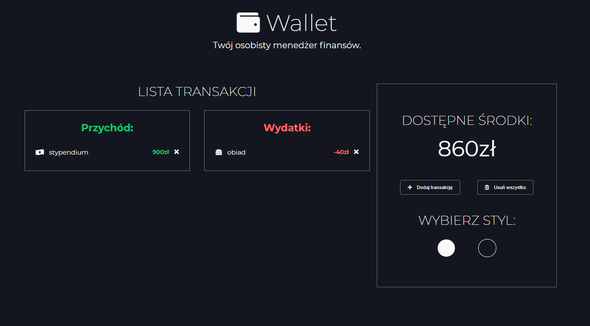
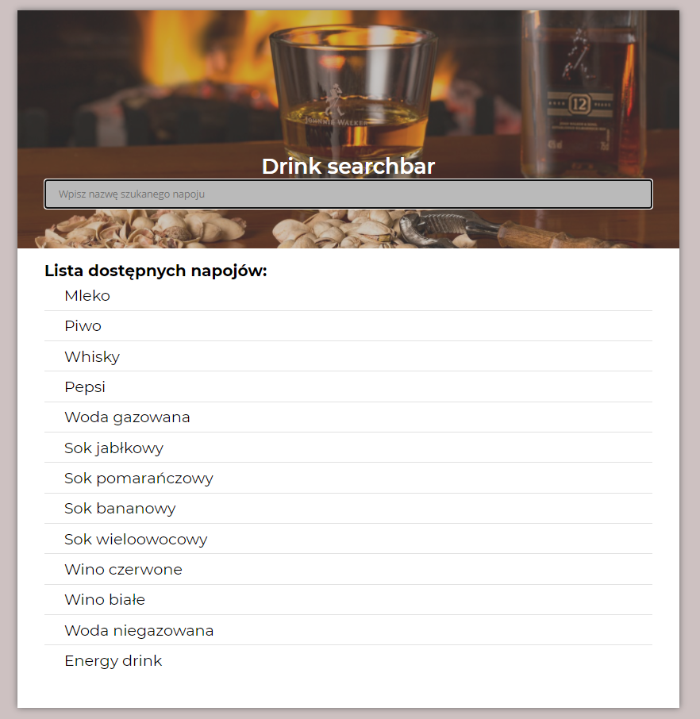
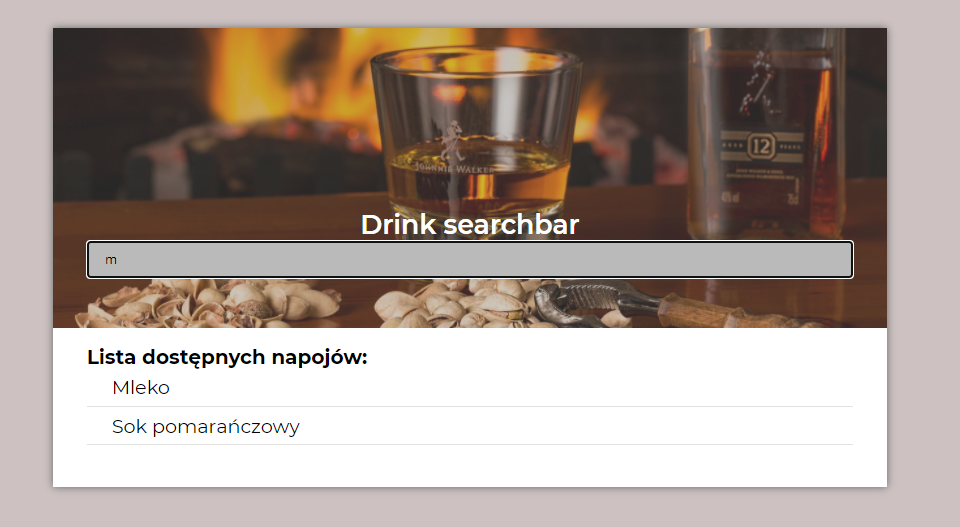
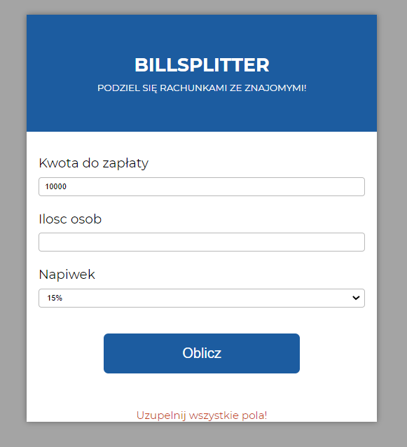
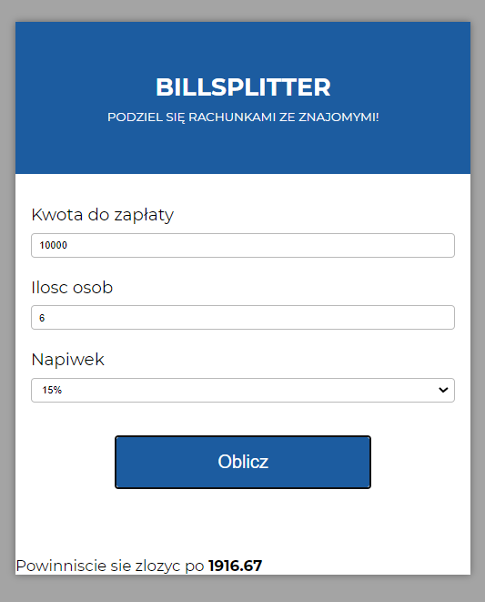

# javascript-tasks
> Repository with couple of projects done within my javascript udemy course.

## Menu
* [Todo List](#todolist)
* [Finance Manager](#financemanager)
* [Searchbar](#searchbar)
* [Billsplitter](#billsplitter)

## Todo List

## Finance Manager

## Searchbar

App that looks for drinks typed by users in the field.

## Billsplitter

